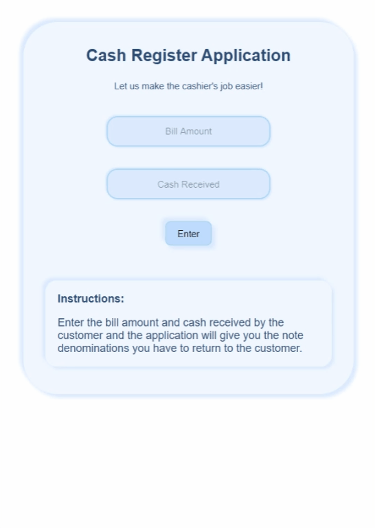

# Getting Started

This is a web-app built with ReactJS, that can be used by the cash registerer. 

---

# DEMO 

     

---

## Description 

1. Enter the bill amount of the customer.
2. Enter the cash given by the customer.
3. Click the "Enter" button. 
4. Hurray! The denominations to be given are shown.

Disclaimer: This website doesn't store any data and/or information given by the user. 

Here's the link to website:
https://birthday-lucky-finder.netlify.app/

---

# Built with:

1. React JS 
2. CSS

****
